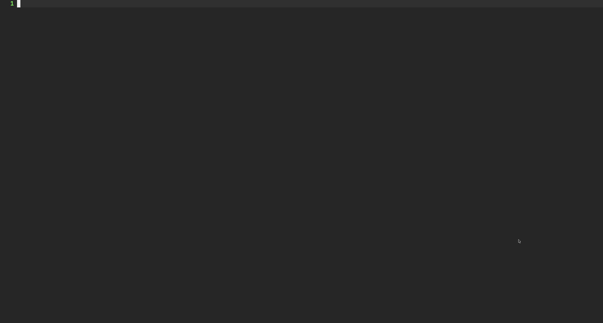
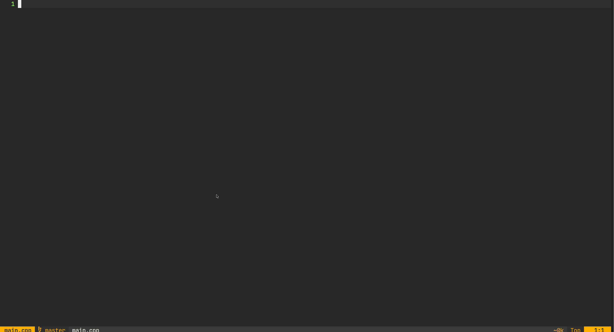
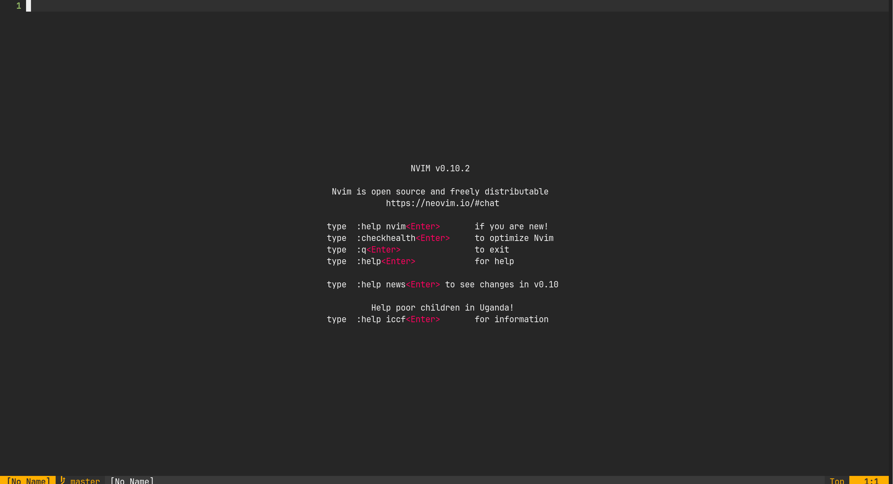
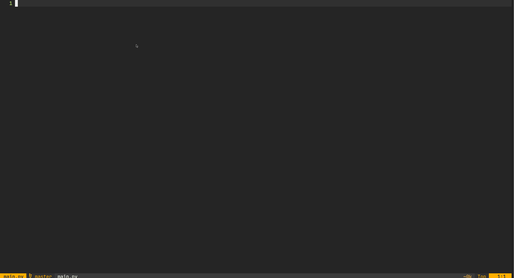

# sandbox :whale2:

notes as code.

This plugin is a wrapper of [ideas-sandbox](https://github.com/dcoello-dev/ideas-sandbox) cli tool if you dont know it check the README! :eyes:.

Use neovim as a note taking system for code snippets and ideas, use your editor as a sandbox to quickly draft code, diagrams, regex, doc and ideas in general.

Sandbox add the posibility to navigate your ideas without taking you out from your dev workflow, quickly look for an specific example and copy paste it in your current code, or create a new idea and draft or test an specific implementation, if you  like it save it for another day! :floppy_disk:.

Sandbox does not store anything on the cloud, your ideas are yours, store it in a git repo or a local directory is up to you! :file_folder:.

## installation :package:

First install `sandbox.nvim`:

```bash
pip install ideas-sandbox
```

Take a look to `sandbox.nvim` README :eyes: to know more about sandbox configuration.

Then install neovim plugin, it depends on telescope :telescope: and toggleterm :shell:.

```lua
  {
    'dcoello-dev/sandbox.nvim',
    dependencies = {
      'nvim-telescope/telescope.nvim',
      'akinsho/toggleterm.nvim',
    },
    config= function()
      require("sandbox").setup({
        work_idea_path="/home/user/codebase/", -- fallbacks on SANDBOX_IDEAS env var
        ideas_path="/home/user/codebase/",     -- fallbacks on SANDBOX_IDEAS env var
        conf_path="/home/user/codebase/",      -- fallbacks on SANDBOX_CONF env var
        execute_km = '<leader>gw',
        open_km = '<leader>gl',
        work_idea_km = '<leader>gm'
      })
    end
  },
```

## configuration

You need to indicate where you want to store your ideas, where your work idea is going to be located (by default same location that your ideas) and where is your environments .toml configuration.

You can do it exporting `ideas-sandbox` env vars or in lua setup function:

```bash
export SANDBOX_IDEAS="path/to/your/ideas"
export SANDBOX_EDITOR="your favourite editor (neovim)"
export SANDBOX_CONF="path to your conf.toml file"
```

## usage :gear:



There are three commands:
- **SReset** {env}: creates a new idea based on an environment.
- **SSave** : save current idea.

There are a few keymaps you can override it in your conf:
- **<leader>gw** : run pipeline for current idea.
- **<leader>gm** : go to current idea.
- **<leader>gl** : search ideas.

## environments :computer:

Environments are defined in a .toml file, dont forget to export env var with the path or add it to lua conf setup:

Lets see some environment examples, if you want to see more examples take a look to `examples/environment.toml` :eyes: :

### cpp

This environment formats code using clang-format, builds and executed current file and provides a Hello World template, simple but efective for small cpp ideas:

```toml
[cpp]
ext = "cpp"
execution = "g++ ${file_path} -o out && ./out && rm out"
format = "clang-format -i ${file_path}"
template = """// sandbox_idea:
// sandbox_name:
// sandbox_description:
// sandbox_env: cpp

#include <iostream>

int main(void) {
    std::cout << "Hello World!" << std::endl;
    return 0;
}"""
```



### python

Same as cpp env this does similar stuff but for python, create simple environments for any language should be easy,:

```toml
[python]
ext = "py"
execution = "python3 ${file_path}"
format = "autopep8 -i ${file_path}"
template = """# sandbox_idea: 
# sandbox_name: 
# sandbox_description: 
# sandbox_env: python

if __name__ == "__main__":
    print("Hello World!")
"""
```



Personally I use bash env to keep installation scripts son when I run the idea I actually install and configure something (node, docker...):

```bash
# sandbox_idea: global/setup
# sandbox_name: install_node
# sandbox_description: install node and npm
# sandbox_env: bash

sudo apt-get update
sudo apt install curl

# check nodesource for latest version
curl -fsSL https://deb.nodesource./setup_20.x | sudo bash -

sudo apt-get install nodejs

nodejs -v
npm -v
```

### regex

This is an example on how to create a regex editor on top of python, similar things can be done to work on mermaid or plantuml locally:

```toml
[regex]
ext = "py"
execution = "python3 ${file_path}"
format = "autopep8 -i ${file_path}"
template = """# sandbox_idea: regex/
# sandbox_name: 
# sandbox_description: 
# sandbox_env: regex

import re
import json

INPUT_TEXT=\"\"\"

\"\"\"

INPUT_REGEX=r" "

if __name__ == "__main__":
    print(json.dumps(list(re.findall(INPUT_REGEX, INPUT_TEXT)), indent=2))
"""
```


